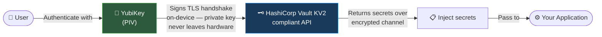
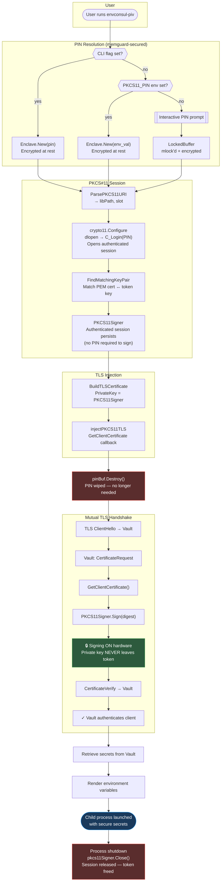

# envconsul-piv

envconsul with hardware-bound mutual TLS. Your YubiKey or any PIV token signs the TLS handshake on-device — the private key never leaves the hardware.

## Architecture



<details>
<summary>Advanced diagram</summary>



</details>

## How to Install

```shell
# Be sure to update the following commands to the latest release version.
# The latest releases can be found here: https://github.com/Warfront1/envconsul-piv/releases
# Currently we only automatically publish releases for linux amd64 and arm64.

wget https://github.com/Warfront1/envconsul-piv/releases/download/v0.13.4-piv2/envconsul-piv_v0.13.4-piv2_linux_amd64.tar.gz
tar -xvf envconsul-piv_v0.13.4-piv2_linux_amd64.tar.gz
sudo mv envconsul-piv /usr/local/bin/envconsul-piv
```

## Configuration and Usage Guide

### YubiKey Setup

If you haven't already configured your YubiKey for PIV use, install `ykman` and dependencies on Ubuntu/Debian:

```bash
sudo apt-add-repository ppa:yubico/stable
sudo apt update
sudo apt install -y yubikey-manager pcscd opensc
sudo systemctl enable --now pcscd
```

> For other distributions, see [Yubico's ykman install guide](https://docs.yubico.com/software/yubikey/tools/ykman/Install_ykman.html#third-party-linux-distributions).

This also works on Windows using the Windows Subsystem for Linux (WSL) with [usbipd-win](https://github.com/dorssel/usbipd-win) to forward USB devices (like your YubiKey) into WSL.

While this guide demonstrates setup with a YubiKey, envconsul-piv works with any PKCS#11-compatible PIV token. The only requirement is a PKCS#11 shared library (like `opensc-pkcs11.so`) that exposes the token's signing capability.

### Environment Variables

Set the following environment variables in your shell or `.bashrc`. Replace the placeholders with your actual configuration values.

```bash
# The address of your Vault server
export VAULT_ADDR='https://<your-vault-url>:443'

# Path to the CA certificate used to verify the Vault server's certificate
export VAULT_CACERT='/path/to/your/vault_public_ca.pem'

# Path to your client certificate (matches the private key in your PIV slot)
export VAULT_CLIENT_CERT='/path/to/your/client_certificate.pem'

# --- PKCS#11 / PIV Settings ---

# Path to the OpenSC PKCS#11 library on your system
# Common path for Ubuntu/Debian: /usr/lib/x86_64-linux-gnu/opensc-pkcs11.so
export VAULT_CLIENT_KEY='pkcs11:/usr/lib/x86_64-linux-gnu/opensc-pkcs11.so'

# Optional: Set your PIN here if you do not want to be prompted manually
# For maximum security, leave it unset.
# export PKCS11_PIN='123456'

# Call envconsul-piv
# Refer to the official envconsul documentation for more details.
# https://github.com/hashicorp/envconsul
SECRET_PATH='<mount-point>/data/<path-to-secret>'

envconsul-piv -upcase \
  -no-prefix \
  -log-level=info \
  -secret "$SECRET_PATH" \
  env | grep <FILTER_KEY>
```

## Repository Setup

- **envconsul-piv** — This repository. Contains documentation, build scripts, and executables.
- **envconsul** — A fork of [envconsul](https://github.com/hashicorp/envconsul), included as a submodule (`./envconsul`).
  An intentionally minimal fork designed to be easy to audit, maintain, and hopefully merge upstream.